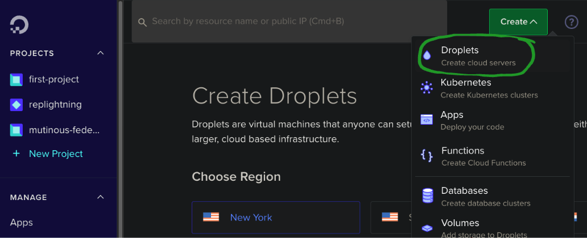
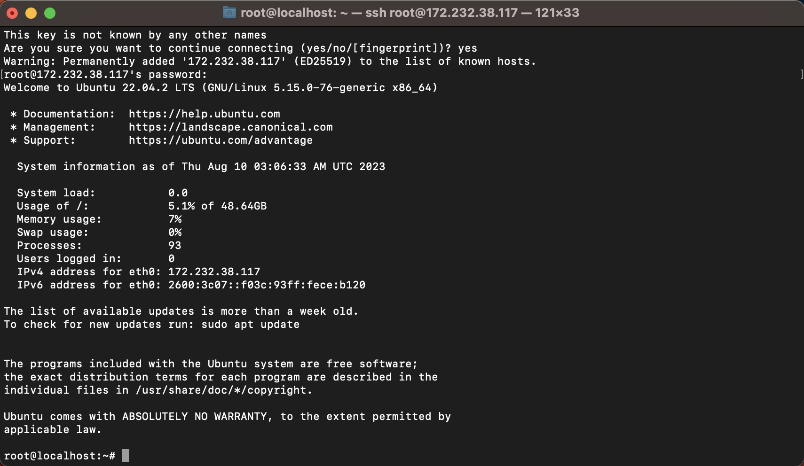

# Setting up Mutiny in the cloud

## Step 1. Provisioning a VPS

I'll be using Digital Ocean, Linode, and Amazon EC2 for this guide, but any VPS provider or your own hardware will work
if it can run Linux and Docker. Feel free to use whichever you're most comfortable with or prefer.

If you know what you're doing, you can skip this step and just install docker and docker-compose on your machine and
skip to step 2.

### 1.1. Digital Ocean Setup

<details>
<summary>
Digital Ocean setup instructions
</summary>
- Create a new droplet, use the default parameters for a "Regular" CPU option ($12 2GB RAM/1 CPU machine).

<p align="center">

</p>

- Default Ubuntu image

<p align="center">

</p>

- You can use a less performant machine, however, things like VSS may be less reliable.

<p align="center">

</p>

- Auth with SSH keys (recommended) or password. Digital Ocean has an excellent guide on how to set up SSH keys if you
  click "New SSH Key" in the "Authentication" section. It also has a great browser based console that you can use to
  access the box directly from the dashboard.

<p align="center">

</p>

- Finalize and create the droplet.

<p align="center">

</p>

- You can SSH into the machine from your terminal by copying the ssh command for key or root user/password. Or just use
  the droplet terminal from the digital ocean console.

<p align="center">

</p>

<p align="center">

</p>

</details>

### 1.2. Linode Setup

<details>
<summary> Click here for Linode setup instructions </summary>

For the Linode Setup we'll use the same $12 2GB/1CPU machine as Digital Ocean. We'll be using Docker, so it recommended
to go to the marketplace and select the "Docker" image. This will make sure your machine has docker and docker-compose
already setup.

<p align="center">

</p>

- Set up the root password (and SSH keys recommended)

<p align="center">

</p>

- Then create the machine.

<p align="center">

</p>

- You can SSH into the machine from your terminal by copying the ssh command for key or root user/password:

<p align="center">

</p>

<p align="center">

</p>

</details>

### 1.3. Amazon EC2 Setup

<details>
<summary> Click here for Amazon EC2 setup instructions </summary>

For the AWS EC2 Setup we'll use the free tier t2.micro machine, which is 1GB RAM/1CPU. This is below the recommended
specs but should be okay.

- Use your ssh keys (you'll have to import them for EC2 in the console beforehand), set a security group, and free tier
  EC2 lets you have up to 30GB of storage.

<p align="center">

</p>

- Then in your EC2 management console select "Connect your instance", adjust the key visibility, and you'll be able to
  ssh into the machine

<p align="center">

</p>

- Then you're good to connect to the machine from a terminal:

<p align="center">

</p>

</details>

### 1.4. Google Cloud Setup

<details>
<summary> Click here for Google Cloud setup instructions </summary>

For the google cloud machine we'll use something a little bigger because we'll also run the lightning gateway on it.
Google VMs generate new ssh keys for you so make sure you copy those down into your local to ssh into the machine.

<p align="center">

</p>

- Then google VMs have a nice SSH button in the console that pops open a bash terminal connect to the machine.

<p align="center">

</p>

</details>

## Step 2. Installing with Docker

You should now have your machines running and be able to ssh into them. We'll install mutiny on them using docker.

You may need git installed on your machine to clone the repo, you can do this with:

```bash
sudo apt-get install git
```

Then clone the repo and cd into it:

```bash
git clone https://github.com/MutinyWallet/mutiny-deploy.git && cd mutiny-deploy
```

To start running Mutiny you'll then need to run docker-compose. You can do this by running the following command:

```bash
docker-compose up -d
```

This will spin up all the needed containers for running your own instance of Mutiny.

### Notes for specific machines:

- If you're running on aws you'll need to install and start docker and docker compose first. You can do this
  by running the following commands (change apt-get to yum if not using ubuntu):

```bash
# update packages
sudo apt-get update
# add docker's gpg key
curl -fsSL https://download.docker.com/linux/ubuntu/gpg | sudo gpg --dearmor -o /usr/share/keyrings/docker-archive-keyring.gpg
# set up the stable repo for docker
echo "deb [arch=$(dpkg --print-architecture) signed-by=/usr/share/keyrings/docker-archive-keyring.gpg] https://download.docker.com/linux/ubuntu $(lsb_release -cs) stable" | sudo tee /etc/apt/sources.list.d/docker.list > /dev/null
# update packages again
sudo apt-get update
# install docker engine
sudo apt-get install docker-ce docker-ce-cli containerd.io docker-compose
# start docker
sudo systemctl start docker
# enable docker startup on boot
sudo systemctl enable docker
# make a new docker group
sudo newgrp docker
# add current user to docker group. restart your shell after running this.
sudo usermod -aG docker $USER
# make sure you set docker socket permissions for your user
sudo chown root:docker /var/run/docker.sock
sudo chmod 660 /var/run/docker.sock
# verify docker is working
sudo systemctl status docker
# restart docker to make sure the permissions are set
sudo systemctl restart docker
```

and if you get a "platform error" when trying to install with docker compose, you can run the following commands to
install the most recent version of docker compose:

```bash
sudo curl -L "https://github.com/docker/compose/releases/latest/download/docker-compose-$(uname -s)-$(uname -m)" -o /usr/local/bin/docker-compose
```

## Step 3. Setting up TLS

Now that you have mutiny running on your machine, you'll need to set up TLS so that you can access it from your browser
safely. We'll be using nginx to do this.

### 3.1. Setting up nginx

You'll need to install nginx on your machine. You can do this by running the following command:

```bash
sudo apt-get install nginx
```

Then you'll need to create a new nginx config file for mutiny. You can do this by running the following command:

```bash
sudo nano /etc/nginx/sites-available/mutiny
```

Then paste the following into the file, be sure to replace `yourdomain.com` with your own domain:

```nginx
map $http_upgrade $connection_upgrade {
    default upgrade;
    ''      close;
}

server {
    listen 80;
    listen [::]:80;
    server_name yourdomain.com;

    location / {
      proxy_set_header Upgrade $http_upgrade;
      proxy_set_header Connection $connection_upgrade;
      proxy_set_header Host $host;
      proxy_pass http://localhost:14499;
    }
}
```

Then save the file and exit. You'll then need to create a symlink to the sites-enabled folder. You can do this by
running the following command:

```bash
sudo ln -s /etc/nginx/sites-available/mutiny /etc/nginx/sites-enabled/mutiny
```

Then you'll need to restart nginx. You can do this by running the following command:

```bash
sudo systemctl reload nginx
```

### 3.2. Setting up TLS with Let's Encrypt

Now that you have nginx running, you'll need to set up TLS with Let's Encrypt. First, you may need to install certbot and the certbot nginx plugin.

```bash
sudo apt-get install certbot python3-certbot-nginx
```

Then you'll need to run the following command to get a certificate:

```bash
sudo certbot --nginx -d yourdomain.com
```

Then you'll need to set up a cron job to renew the certificate. You can do this by running the following command:

```bash
sudo crontab -e
```

Then paste the following into the file:

```bash
0 12 * * * /usr/bin/certbot renew --quiet
```

Then save the file and exit.


## Step 4. Updating Mutiny

To update mutiny you'll need to pull the latest changes from the repo and then restart the docker containers. You can
do this by running the following commands:

cd into the mutiny-deploy folder:

```bash
cd mutiny-deploy
```

Then pull the latest changes:

```bash
git pull
```

Then restart the docker containers:

```bash
docker-compose restart
```
